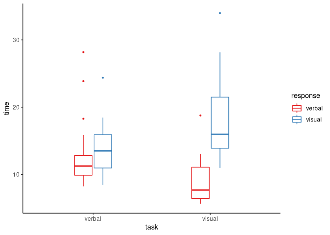

<!-- README.md is generated from README.Rmd. Please edit that file -->

psyntur 
=====================================================================

<!-- badges: start -->
<!-- badges: end -->

The goal of `psyntur` is primarily to provide some functions and
data-sets that are helpful with teaching statistics and data analysis to
students in the Psychology Department at Nottingham Trent University.

Installation
============

You can install the development version of `psyntur` using `devtools`:

    devtools::install_github("mark-andrews/psyntur")

If `devtools` is not available, install it with
`install.packages('devtools')`.

The source code is available here:
<a href="https://github.com/mark-andrews/psyntur" class="uri">https://github.com/mark-andrews/psyntur</a>.

Examples
========

    library(psyntur)
    tukeyboxplot(y = time, x = task, data = vizverb, by = response)

    shapiro_test(time, by = task, data = vizverb)
    #> # A tibble: 2 x 3
    #>   task   statistic  p_value
    #>   <chr>      <dbl>    <dbl>
    #> 1 verbal     0.861 0.000168
    #> 2 visual     0.914 0.00512

Documentation
=============

Vignettes explaining the main functions provides by `psyntur` are as
follows:

-   [Simple data
    visualization](https://mark-andrews.github.io/psyntur/articles/visualization.html)
-   [Simple data
    exploration](https://mark-andrews.github.io/psyntur/articles/exploration.html)
-   [Some helper functions for statistical
    analysis](https://mark-andrews.github.io/psyntur/articles/simplestats.html)

In addition, all functions and data sets are listed
[here](https://mark-andrews.github.io/psyntur/reference/index.html),
each with links to their help pages.
